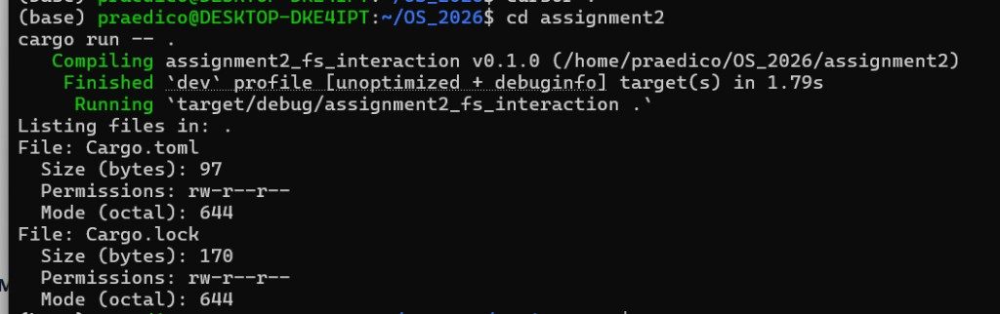
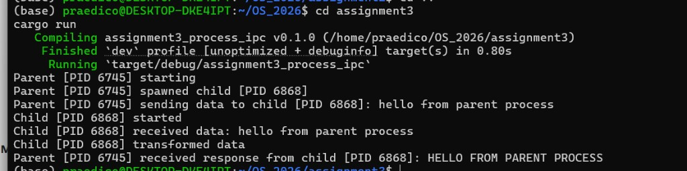
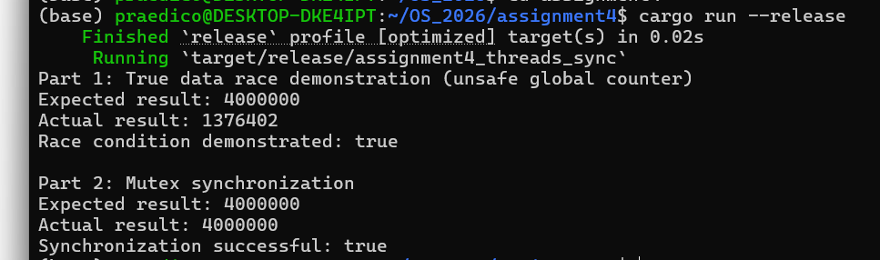

## Assignment 1: Environment Setup & Basic System Info

This Bash script prints basic environment details for quick system inspection. It uses:
- `uname -a` to show operating system and kernel details
- `whoami` to show the current logged-in user
- `pwd` to show the current working directory

Run commands:

```bash
chmod +x assignment1/system_info.sh
./assignment1/system_info.sh
```


## Assignment 2: File System Interaction

This Rust program receives a directory path and inspects files inside it. It uses:
- `std::fs::read_dir` to iterate through directory entries
- `std::fs::metadata` to retrieve metadata for each entry
- `metadata.len()` to read file size in bytes
- `metadata.permissions().mode()` to access Unix mode bits
- `PermissionsExt` to work with Unix permission data

These functions interact directly with the Linux filesystem and retrieve file metadata such as size and permissions. This assignment is implemented as a small Cargo project because Cargo is the standard Rust build tool.

Run command:

```bash
cd assignment2
cargo run -- .
```

Execution screenshot:



## Assignment 3: Process Creation & IPC

This Rust program demonstrates parent-child process communication. It uses:
- `std::process::Command` to create a child process
- `Stdio::piped()` to create stdin/stdout pipes for IPC
- parent stdin writing to send data to the child
- child stdout writing and parent stdout reading to return transformed data

Pipes are appropriate for parent-child IPC because they provide a simple, direct byte stream between related processes without requiring external services. This assignment is implemented as a small Cargo project with no external dependencies.

Run command:

```bash
cd assignment3
cargo run
```

Execution screenshot:




## Assignment 4: Threads & Synchronization

A race condition happens when multiple threads access and modify shared data at the same time, and the final result depends on timing.

In Part 1, safe Rust still prevents true memory data races, so the program demonstrates a lost update problem by intentionally using `AtomicU64` incorrectly with separate `load` and `store` operations. In Part 2, a `Mutex` protects the critical section, serializes updates, and guarantees the correct final counter value. This assignment is implemented as a small Cargo project with no external dependencies.

Run command:

```bash
cd assignment4
cargo run --release
```

Execution screenshot:




Although the assignment examples mention Python and C, Assignments 2, 3, and 4 are implemented in Rust because Rust exposes the same operating-system concepts while providing memory safety.
